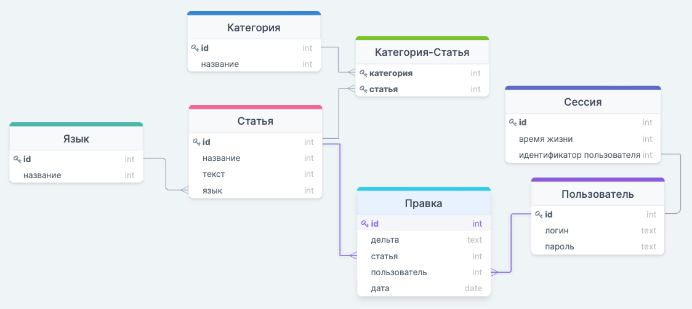
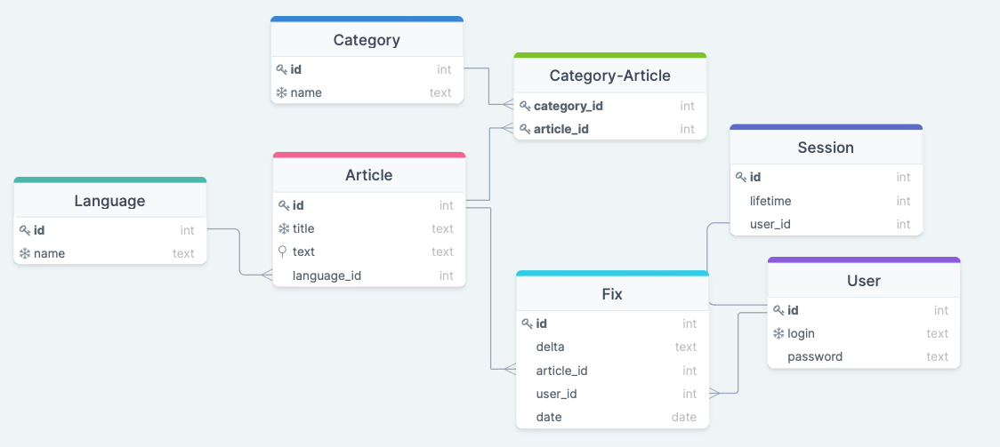

# Wikipedia

## 1. Тема и целевая аудитория
### 1.1. Тема
[Wikipedia](https://ru.wikipedia.org/) — общедоступная многоязычная универсальная интернет-энциклопедия
со свободным контентом, реализованная на принципах вики.

### 1.2. Целевая аудитория
За март 2022 года сервис насчитывает 5.3 млрд посетителей сайта в месяц [[2]](https://www.similarweb.com/ru/website/wikipedia.org/) или около 170 млн посетителей в день.

Топ 5 стран которые, чаще других посещают Wikipedia [[2]](https://www.similarweb.com/ru/website/wikipedia.org/):
1) Соединённые штаты - 23.99%
2) Япония - 5.81%
3) Великобритания - 5.48%
4) Германия - 5.41%
5) Россия - 5.01%

### 1.3. MVP
* Регистрация и авторизация
* Чтение статьи
* Поиск статьи по названию по поисковой строке
* Поиск статьи по ключевым словам по поисковой строке
* Создание статьи
* Редактирование статьи

## 2. Расчет нагрузки
### 2.1. Продуктовые метрики
* Месячная аудитория - 5.3 млрд [[2]](https://www.similarweb.com/ru/website/wikipedia.org/)
* Суточная аудитория - 170 млн [[2]](https://www.similarweb.com/ru/website/wikipedia.org/)
* Среднее количество страниц за визит - 3.11 [[2]](https://www.similarweb.com/ru/website/wikipedia.org/)
* Средняя продолжительность визита - 3 минуты 55 секунд [[2]](https://www.similarweb.com/ru/website/wikipedia.org/)

#### Сводная таблица количества действий пользователя по типам в день [[3]](https://stats.wikimedia.org/RU/TablesWikipediaEN.htm)
Тип запроса                     | Количество (разброс) | Среднее количество
--------------------------------|----------------------|-------------------
Регистрация и авторизация       | 0-1                  | 0.0003
Чтение статьи                   | 1-5                  | 3.107
Поиск статьи по названию        | 0-2                  | 0.001
Поиск статьи по ключевым словам | 0-2                  | 0.001
Создание статьи                 | 0-1                  | 0.00000012
Редактирование статьи           | 0-4                  | 0.000094

### 2.2. Технические метрики
#### 2.2.1 Размер хранения
Согласно данным Kiwix [[4]](https://wiki.kiwix.org/wiki/Main_Page/ru) весь контент Wikipedia на текущий момент весит 30.9 Гб или 0.03 Тб.
Из них примерно 5/6 - статический контент (изображения, видео и др), а оставшиеся 1/6 - текст.
Пользователей не считаем, так как их много меньше чем статей и, как следствие, занимают они сравнительно немного места.

* Статический контент - 25.75 Гб или 0.026 Тб
* Текст - 5.15 Гб или 0.0052 Тб

#### 2.2.2 Сетевой трафик
* Общее количество посещений страниц в месяц = `5.3*10^9 * 3.11 = 16483*10^6 pages/day`
* Средний вес статьи = `100 Кб` [[5]](https://ru.wikipedia.org/wiki/Википедия:Размер_статей#Технические_ограничения)

Таким образом, получаем:
* Суммарная сетевая нагрузка (Гб/сутки) = `16483*10^6 * 100 / (30 * 1024) = 53.7*10^6 GB/day`
* Средняя сетевая нагрузка (Гб/сек) = `53.7*10^6 / (24 * 60 * 60) = 621.01 GB/sec`

#### 2.2.3 RPS
Пользователь сервиса в среднем совершает 3.11 операций.
Следовательно, `RPS = 5.3*10^9 * 3.11 / (30 * 24 * 60 * 60) = 6359`

#### RPS по типам запросов
Тип запроса                     | Чтение/запись | RPS
--------------------------------|---------------|--------
Регистрация и авторизация       | Запись        | 0.6
Чтение статьи                   | Чтение        | 6353
Поиск статьи по названию        | Чтение        | 2
Поиск статьи по ключевым словам | Чтение        | 2
Создание статьи                 | Запись        | 0.00024
Редактирование статьи           | Запись        | 0.19

## 3. Логическая схема

## 4. Физическая схема

Отдельно стоит обратить на условные обозначения, которые можно увидеть на схеме выше, напротив полей таблиц.
* Ключ - Primary key
* Снежинка - Unique поле
* Булавка - Index

Помимо этого, предполагается, что первичный ключ и уникальные поля являются индексами.

Подробнее о том, какие базы были выбраны для реализации логической схемы, указано в пункте 5 (Технологии).

## 5. Технологии
Технология                     | Область применения | Причины выбора
--------------------------------|---------------|--------
Golang  | Backend | Встроенная поддержка многопоточности, легковесность, удобная интеграция с внешними зависимостями
Gin | Фреймворк для бэкенда | Один из самых быстродейственных web-фреймворков для Go и при этом один из самых поддерживаемых
Redis | Хранение сессий | Крайне высокая скорость работы с данными сессий
PostgreSQL | Хранение пользователей, статей и др. | Обширный функционал, эффективная репликация
HTML + CSS + TypeScript | Frontend | Рабочая связка для написания высокоэффективных веб-сервисов
React | Frontend | Модульность, быстрый рендеринг, высокая run-time производительность
HTTPS | Протокол связи между фронтендом и бэкендом | Общепризнанный вариант относительно безопасной передачи данных
JSON | Метод передачи данных между фронтендом и бэкендом | Удобное чтение и запись, поддержка многими языками

## 6. Источники
1. https://ru.wikipedia.org/
2. https://www.similarweb.com/ru/website/wikipedia.org/
3. https://stats.wikimedia.org/RU/TablesWikipediaEN.htm
4. https://wiki.kiwix.org/wiki/Main_Page/ru
5. https://ru.wikipedia.org/wiki/Википедия:Размер_статей#Технические_ограничения